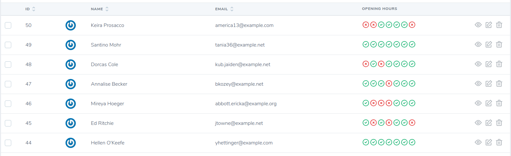
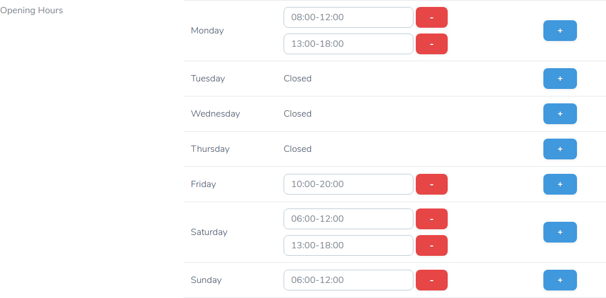
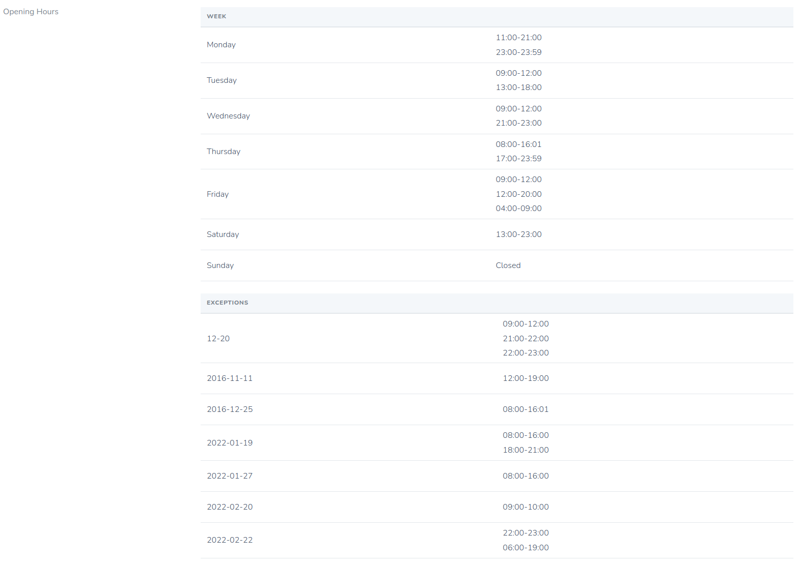

# Nova Opening Hours Field

[](https://packagist.org/packages/sadekd/nova-opening-hours-field)
[](https://packagist.org/packages/sadekd/nova-opening-hours-field)
[](https://packagist.org/packages/sadekd/nova-opening-hours-field)
[](https://packagist.org/packages/sadekd/nova-opening-hours-field)

[Laravel](https://laravel.com) [Nova](https://nova.laravel.com) custom field for [Spatie Opening Hours](https://github.com/spatie/opening-hours)

### Index



### Form



### Detail



## Installation

You can install the package in to a [Laravel](https://laravel.com) app that uses [Nova](https://nova.laravel.com) via composer:

```bash
composer require sadekd/nova-opening-hours-field
```

## Usage

Laravel Migration

```php
$table->json('opening_hours')->nullable();
```


Laravel Model

```php
protected $casts = [
    'opening_hours' => 'array',
];
```

Nova Resource

```php
NovaOpeningHoursField::make(__('Opening Hours'), 'opening_hours'),
```

## TODO

- [ ] Explode interval input => time fields
- [ ] Validation
- [x] Localization
- [x] Exceptions
- [ ] Tests

## License

The MIT License (MIT). Please see [License File](LICENSE.md) for more information.
