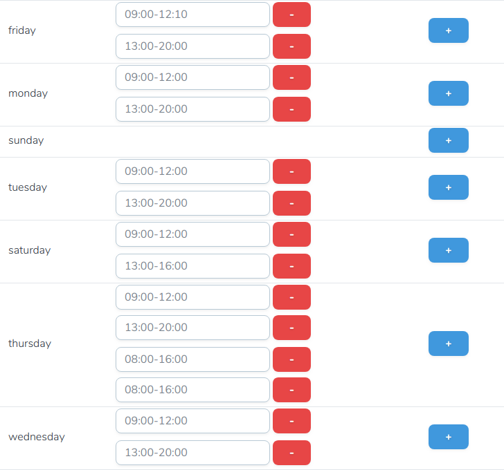

# Nova Opening Hours Field

Laravel Nova custom field for [Spatie Opening Hours](https://github.com/spatie/opening-hours)



## Installation

You can install the package in to a Laravel app that uses [Nova](https://nova.laravel.com) via composer:

```bash
composer require sadekd/nova-opening-hours-field
```

## Usage

Laravel Model

```php
protected $casts = [
    'opening_hours' => 'array',
];
```

Nova Resource

```php
public function fields(Request $request)
{
    return [
        ID::make(),
        NovaOpeningHoursField::make('opening_hours'),
        ...
```

## TODO

- [ ] Explode interval input => time fields
- [ ] Validation
- [ ] Localization
- [ ] Exceptions
- [ ] Tests

## License

The MIT License (MIT). Please see [License File](LICENSE.md) for more information.
